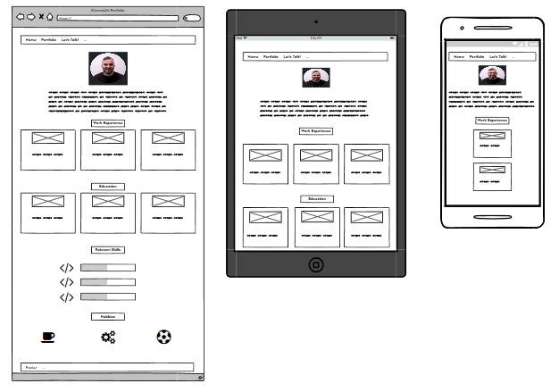
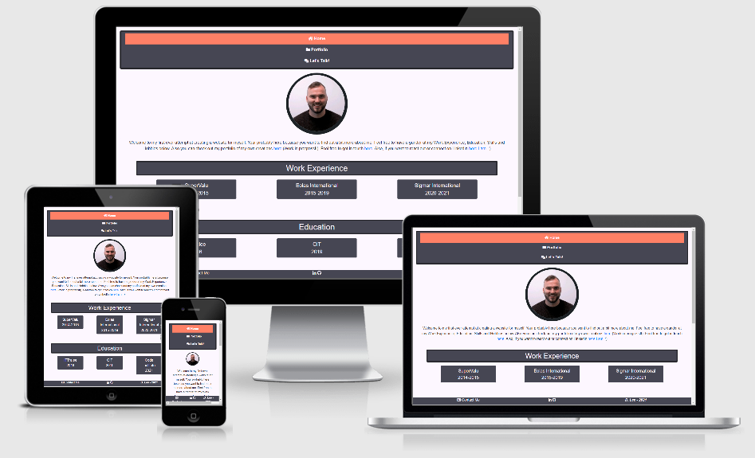

# First Milestone Project
This project was completed to showcase my own abilities with HTML and CSS and to also showcase projects that have been completed to date and also that can be added for the future.
It is my own personal website where anyone can view and review previous projects and can also get intouch if they would like to hear more.
## UX
This website was build for Recruiters and Talent Acquisition professionals looking for potential hires where they can have a good overview of myself my experience, education, skills and hobbies. 
It also provides them with the opportunity to view projects that I have completed.

* As a recruiter or TA if they were to come across my websites and they are looking for my experience to date thay can do so by viewing the landing page and clicking on the different positions and get a full breakdown of my responsibilities
* As a recruiter or TA if they wanted to see what projects I have completed they can do sop easily by selecting the portfolio section of my website where they can click on each project and it will take them to that specific project.
* If a recruiter was looking to get in touch they have the option to use the form available or also to click on the link to LinkedIn and reach out if that way is preferred.

Below is a link to the wirframe which gives an initial overview of the design process:

## Features
### Existing Features
* Website Overview and its function: Located in the Home page it allows users to get a full understanding of the websites purpose.
* Experience: Gives the user the chance to get a significantly detailed overview of the work experience attained to date.
* Education: Gives the user the opportunity to view colleges attended as well as the programme studied.
* Skills: Gives the user an overview of the core competencies.
* Portfolio: Gives the user the opportunity to select any project of their choosing by simply clicking on it where it will take them to a seperate webpage where they can view that particular project.
* Contact: Allows the user to get intouch via multible channels. The user can select the LinkedIn logo and be brough to the profile page where a connection request can be sent as well as the option to fill out the contact form and get in touch that way also.

### Features Left to Implement
* Projects as they are completed.
* A cleaner looking home page where is is a bit more responsive to different devices.
* An updated Contact form where more questions are asked.
* Additional styling using CSS for different sections of the webpage.
## Technologies Used
* HTML
* CSS
* Bootstrap Library
## Testing
1. Contact form
    1. Select the contact page on the website
    2. Enter Details required
    3. Click the Submit Button
    4. A message needs to be setup so that an error or success message appears depending on the imput by the user.
2. Using all clickable links
    1. If a link is clickable and opens an external webpage it was tested.
    2. If unsuccessful or the link was broken it was ammended.
    3. If successful it was made sure that the link is the correct landing page.
3. Functionality acriss different devices
    1. Site was tested across multiple devices.
    2. It was tested using the Chrome Developer Tool so that it can give a good overview of the website across multible devices.
    3. The website was found to be responsive across PC, Laptop and Tablet but needs additional styling to be fully ready for mobile devices.
4. Modal Functionality
    1. All modals accross the website were tested to ensure that they had the correct information as well as being user friendly.
    2. If a modal is openned it is clearly visable where a user can close an openned modal.
    3. Any alterations required were complete.

## Deployment

This project was developed using GitPod, committed using git and pushed to GitHub using the built in functionalities within GitPod.

### To Deploy this page to GitHub Pages from its [GitHub repository](https://github.com/Diumraid/first-milestone-project), the following steps were taken:
 1. Log into GitHub
 2. Select the repository: Diumraid/first-milestone-project
 3. Select settings from the menu items near the top of the page.
 4. Scrool down to the GitHub Pages Section.
 5. Under source make sure that Master Branch is selected.
 6. Then select save and the website will be deployed.
 7. Scroll back down to the GitHub Pages section of the website and copy the URL provide and paste it into your browser to view.

### To run this project locally:
1. Follow this link to the [GitHub repository](https://github.com/Diumraid/first-milestone-project).
2. Under the repository name select use this template.
3. A new page will be openned where you will be asked to name your new repository.
4. Give the project a name and then click Creat repository from template.
5. A clone of the repository will then be created.
## Credits
### Content
All content on the webpage is my own.
### Media
The photos used on this site were obtained from my own personal library, [SuperValu](https://www.supervalu.ie/), [Eolas International](https://www.eolasinternational.com/) and [Sigmar International](https://www.sigmarrecruitment.eu/?redirect=true).
### Acknowledgements
I received my inspiration for this project by all the great content from the Code Institute and the lecturers as well as the IT professionals that I have spoken to in the past.